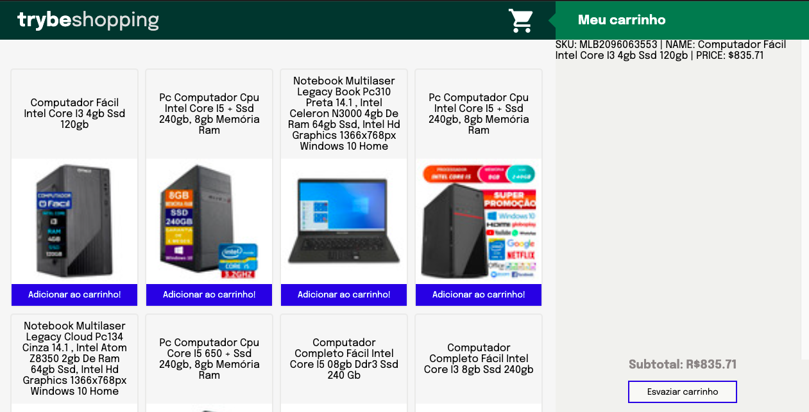

# Shopping Cart
### Projeto realizado durante o módulo de Fundamentos Desenvolvimento Web na Trybe 💚

### Tecnologias utilizadas:

  
  
  
  

### Sobre o desenvolvimento:
- Individual;

Objetivos:
* Fazer requisições a uma API (Application Programming Interface) do Mercado Livre;

* Utilizar os seus conhecimentos sobre JavaScript, CSS e HTML;

* Trabalhar com funções assíncronas;

* Testar aplicação;

Requisitos:
* Crie uma listagem de produtos;

* Adicione o produto ao carrinho de compras;

* Remova o item do carrinho de compras ao clicar nele;

* Carregue o carrinho de compras através do LocalStorage ao iniciar a página;

* Some o valor total dos itens do carrinho de compras;

* Implemente a lógica no botão Esvaziar carrinho para limpar o carrinho de compras;

* Adicione um texto de "carregando" durante uma requisição à API;

* Desenvolva testes de no mínimo 25% de cobertura total e 100% da função fetchProducts;

* Desenvolva testes de no mínimo 50% de cobertura total e 100% da função fetchItem;

* Desenvolva testes de no mínimo 75% de cobertura total e 100% da função saveCartItems;

* Desenvolva testes para atingir 100% de cobertura total e 100% da função getSavedCartItems;

[Deploy do projeto](https://shopping-cart-iota-one.vercel.app/)

